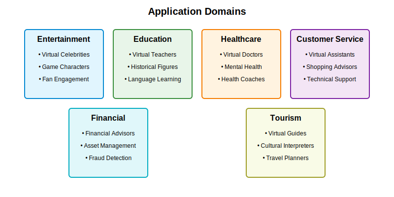

# AI-based Virtual Personality Generation and Interaction System

This repository contains the implementation of an AI-based system for generating and interacting with virtual personalities based on real or fictional characters. The system uses cutting-edge technologies including ultra-high-speed communication, edge AI, and advanced semiconductor processes to create immersive and realistic virtual personality experiences.

## Overview

Our system creates virtual personalities that closely mimic real individuals or fictional characters, providing natural and engaging interactions across multiple platforms. The technology combines multimodal data processing, real-time emotion analysis, and continuous learning to deliver personalized experiences across entertainment, education, healthcare, and other domains.

## Key Features

- **Realistic Virtual Personality Generation**: Creates virtual personalities that are difficult to distinguish from real individuals, with sophisticated AI models trained on multimodal data.
- **Natural and Immersive Interaction**: Provides fluid, context-aware conversation and response using multimodal interaction and real-time emotion analysis.
- **Personalized Experience**: Adapts to individual user preferences, interests, and context information to provide tailored interactions.
- **Ethical and Secure Design**: Built-in AI ethics guidelines and blockchain-based security to ensure privacy protection, copyright compliance, and prevention of misuse.
- **Cross-Platform Support**: Consistent experience across VR/AR, hologram, mobile apps, and other platforms.
- **Continuous Learning**: Federated learning techniques for ongoing improvement while protecting privacy.
- **Multi-Industry Applications**: Applicable in entertainment, education, healthcare, customer service, and more.

## System Architecture

The system consists of six main components:

1. **Data Collection and Analysis Module**: Collects and processes multimodal data in real-time using edge AI for immediate preprocessing and analysis.
2. **Virtual Personality Generation and Learning Module**: Creates and trains virtual personalities using advanced AI chips and deep learning models.
3. **Interaction Management Module**: Facilitates natural, engaging exchanges between users and virtual personalities through multimodal communication.
4. **Ethics and Security Management Module**: Ensures ethical use and robust security through blockchain technology and built-in AI ethics guidelines.
5. **Multi-Platform Support Module**: Provides optimized interfaces for various platforms including VR/AR, holograms, and mobile applications.
6. **Continuous Learning and Improvement Module**: Utilizes federated learning for ongoing performance enhancement while maintaining privacy.

## Applications

### Entertainment
- Virtual celebrities and influencers
- Interactive game characters
- Fan engagement experiences

### Education
- Personalized virtual teachers
- Historical figure simulations
- Language learning partners

### Healthcare
- Virtual doctors and mental health counselors
- Personalized health coaches
- Remote patient support

### Customer Service
- Intelligent virtual assistants
- Personalized shopping advisors
- Technical support agents

## Implementation Details

The implementation leverages:

- Ultra-high-speed communication for real-time data processing
- Edge AI for immediate data preprocessing
- Advanced semiconductor processes for high-performance AI chips
- Large language models and generative adversarial networks (GANs)
- Reinforcement learning for optimizing behavior and responses
- Multimodal interaction through natural language processing, speech recognition, and computer vision
- Blockchain technology for enhanced security and privacy

## Project Structure

```
.
├── src/                # Source code for implementation
│   ├── data/           # Data collection and processing
│   ├── models/         # AI models for personality generation
│   ├── interaction/    # Interaction management system
│   ├── ethics/         # Ethics and security management
│   ├── platforms/      # Multi-platform support
│   └── learning/       # Continuous learning components
├── doc/                # Documentation
│   ├── images/         # Visual aids and diagrams
│   ├── api/            # API documentation
│   ├── architecture/   # Architecture documentation
│   └── examples/       # Usage examples
└── deployment/         # Deployment configurations
    ├── local/          # Local deployment setup
    ├── cloud/          # Cloud deployment configurations
    └── simulation/     # Simulation environment
```




## Getting Started

See the [documentation](doc/) for detailed instructions on setting up and using the system.

---

*Patent Pending*